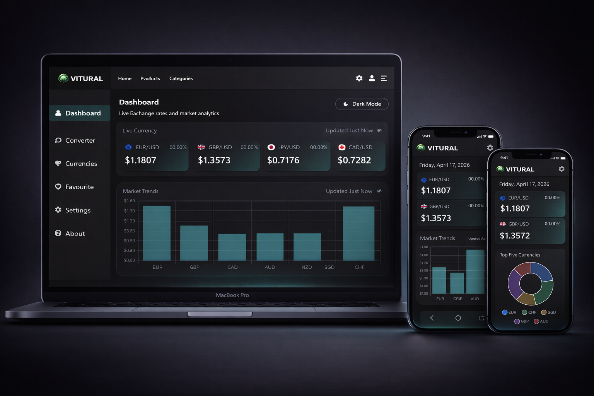
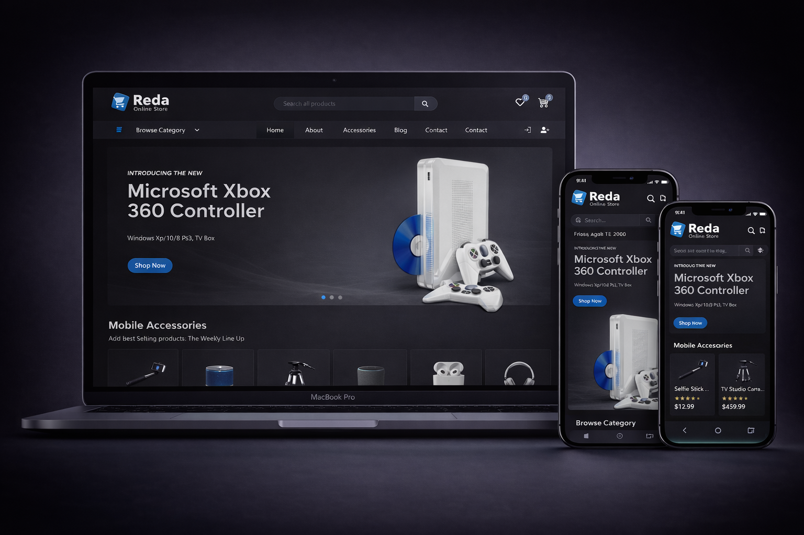

<h1 align="center">Mohamed Saleh 👋</h1>
<h3 align="center">Front-End Developer | React & Next.js</h3>

<h2>🚀 About Me</h2>

I'm <strong>Mohamed Saleh</strong>, a 21-year-old <strong>Front-End Developer</strong> with a background in <strong>Digital Marketing</strong>. 
I combine <strong>design, development, and marketing thinking</strong> to build modern, high-converting web applications.

<ul align="center">
  <li>💻 Specialized in building responsive and scalable web apps</li>
  <li>⚡ Focused on performance, clean UI, and user experience</li>
  <li>🌱 Currently improving my skills in advanced React & Next.js</li>
  <li>🤝 Open to freelance and collaboration opportunities</li>
</ul>

<h2>🛠️ Tech Stack</h2>

  

<h2 align="center">🚀 Featured Projects</h2>

<!-- Dashboard -->

<h3 align="center">📊 Dashboard App</h3>

  

  Advanced dashboard with real-time data, multi-language support, and smooth UX

  
  
  
  
  
  
  
  
  

<!-- E-Commerce -->

<h3 align="center">🛒 E-Commerce App</h3>

  

  Modern e-commerce experience with dynamic product pages and smooth user interactions

  
  
  
  
  
  
  
  

<h2>📈 What I Can Do</h2>

<ul>
  <li>Build responsive websites (Mobile First)</li>
  <li>Convert UI/UX designs to real websites</li>
  <li>Create modern dashboards & admin panels</li>
  <li>Optimize performance & user experience</li>
</ul>

<h2>📫 Contact Me</h2>

<ul>
  <li>📧 Email: <strong>smaratrader2005@gmail.com</strong></li>
  <li>📱 Instagram: <a href="https://www.instagram.com/xs_______707/">xs_______707</a></li>
</ul>

<h2>⭐ Support</h2>

If you like my work, consider giving a ⭐ to my repositories!

